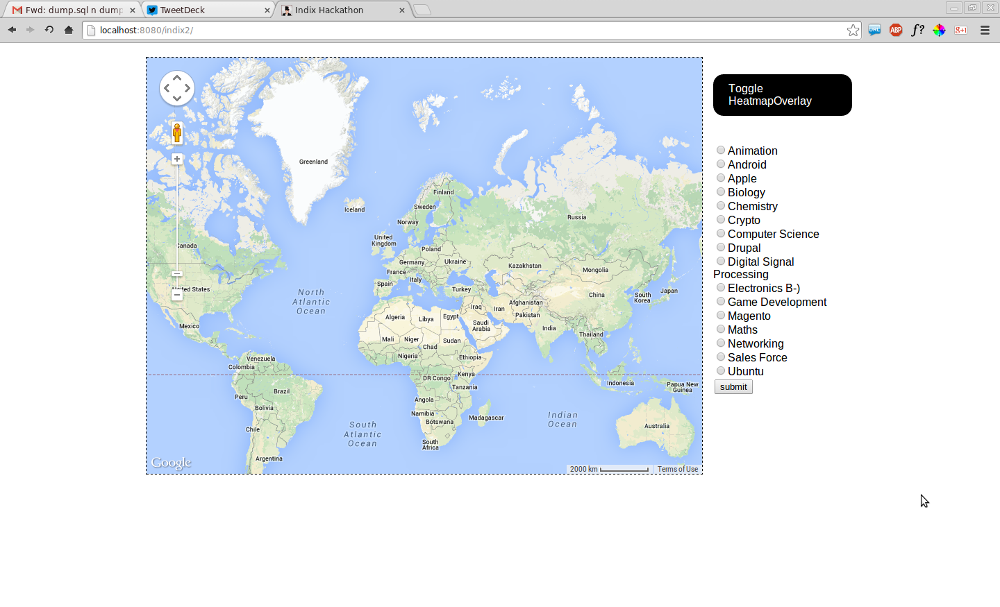
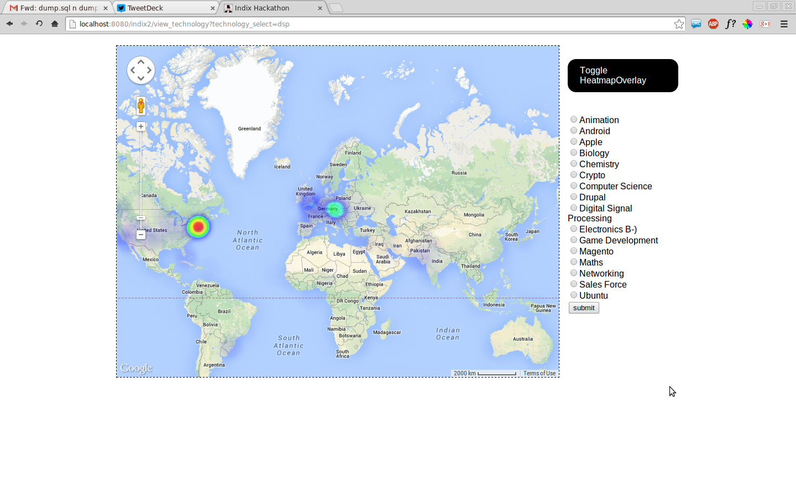

Stack Exchange HeatMap
======================

What is it?
-----------
This application generates a heatmap of various technologies across the world from StackExchange Dump. The stackexchange dump was parsed and stored as a MySQL database the dump of which is also available. 

Technologies Used
----------------------
* A Java servlet app engine
* MySQL database
* HeatMaps.js
* SAX Parser to parse raw XML data 


How to restore the database dump
--------------------------------

* Create an empty database by the name 'stack_exchange' (or anyother name in which case you might have to edit the java file) in your MySQL server.
* Dump the sql file into your server using
```
$ mysql -u <username> -p<password> stack_exchange < stack_exchange.sql
```

Screenshots
-----------

**Home screen**

**App View**

**Another App View**


* * *
Made at [Indix's DataMonster]("http://datamonster.in") Hackathon by [Sai Pranav]( "https://github.com/saipranav"), [Harini]("http://harinivc.in") and [I]("http://www.dwarak.in")
